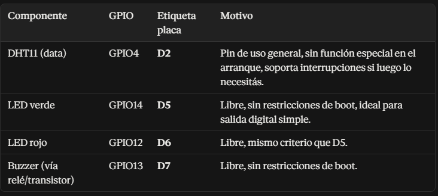

Prompt: Hi, muéstrame un sketch para el mismo contexto con ambos escenarios (sala de refrigeración y sala de racks) pero ahora se reemplazarán los kits de desarrollo ESP32 s por kits de desarrollo ESP8266. Selecciona y diseña también para lograr un óptimo funcionamiento, el considerar los GPIOs que eviten algún tipo de conflicto, describiendo y listando cada uno asociado a los componentes del circuito.

Respuesta (Claude): **Diferencias clave respecto a la versión ESP32:**

`#include <ESP8266WiFi.h>` en lugar de `<WiFi.h>` — el resto de la lógica (WiFi no bloqueante, reconexión MQTT, flanco de alarma) es idéntica.

**GPIOs seleccionados para NodeMCU ESP8266 (ESP-12E) y por qué:**

| Componente | GPIO | Etiqueta placa | Motivo |
|---|---|---|---|
| DHT11 (data) | GPIO4 | **D2** | Pin de uso general, sin función especial en el arranque, soporta interrupciones si luego lo necesitás. |
| LED verde | GPIO14 | **D5** | Libre, sin restricciones de boot, ideal para salida digital simple. |
| LED rojo | GPIO12 | **D6** | Libre, mismo criterio que D5. |
| Buzzer (vía relé/transistor) | GPIO13 | **D7** | Libre, sin restricciones de boot. |

**GPIOs que evité deliberadamente, y por qué:**

- **GPIO0 (D3)** y **GPIO2 (D4)**: son pines de *boot strapping* — su nivel lógico al energizar la placa determina el modo de arranque (programación vs ejecución normal). Si un LED, relé o sensor los mantiene en un estado distinto al esperado, el ESP8266 puede no bootear o quedar en modo flash. Además, GPIO2 suele estar conectado al LED azul integrado de la placa, lo que generaría conflicto visual.
- **GPIO15 (D8)**: debe estar en LOW obligatoriamente durante el arranque; si el buzzer/relé quedara conectado ahí con una resistencia pull-up externa o en estado indefinido, podría impedir el boot o disparar el buzzer brevemente al energizar.
- **GPIO16 (D0)**: no genera interrupciones y no tiene resistencia pull-up interna; lo dejé libre por si más adelante necesitás usarlo para *deep sleep* (wake-up), aunque no participa en este proyecto.
- **GPIO1/GPIO3 (TX/RX)**: reservados para el puerto serie, usarlos como GPIO normales impediría ver el `Serial.print` de diagnóstico (útil para depurar en campo).

El resto de la lógica del sketch (umbral 28°C, publicación solo en el flanco de disparo, payloads `UMBRAL`/`RACKS`, LEDs y buzzer reflejando estado en tiempo real) se mantiene exactamente igual que en la versión ESP32, así que el comportamiento en Home Assistant no cambia.